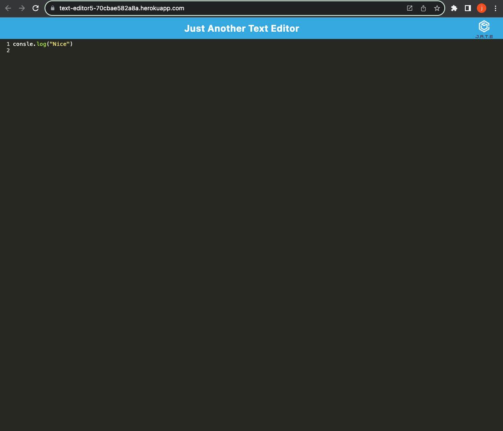

# text-editor

## **Description**
Just another text editor. Users can open this application adn downolad it on their local device as well so it operates offline. Users are able to input text into the application.

- - - -
## **Table of Contents**
- [Usage](#usage)
- [Website Preview](#website-preview)
- - - -
## **Usage**
To access and use our project, click the "Loom" link shown in the [Website Preview](#website-preview) section below. 

Click on the "sign up" button at the top right to enter your name, email and password. After login, select a storyline and continue to follow the prompts as they appear. Each decision alters the escape journey, as players are able to create custom paths and items to collect, store and use along the way. 
 

- - - -
## **Website Preview**
[text-editor](https://text-editor5-70cbae582a8a.herokuapp.com/) 

- - - - 

MIT License

Copyright (c) 2023 Julian Losak

Permission is hereby granted, free of charge, to any person obtaining a copy
of this software and associated documentation files (the "Software"), to deal
in the Software without restriction, including without limitation the rights
to use, copy, modify, merge, publish, distribute, sublicense, and/or sell
copies of the Software, and to permit persons to whom the Software is
furnished to do so, subject to the following conditions:

The above copyright notice and this permission notice shall be included in all
copies or substantial portions of the Software.

THE SOFTWARE IS PROVIDED "AS IS", WITHOUT WARRANTY OF ANY KIND, EXPRESS OR
IMPLIED, INCLUDING BUT NOT LIMITED TO THE WARRANTIES OF MERCHANTABILITY,
FITNESS FOR A PARTICULAR PURPOSE AND NONINFRINGEMENT. IN NO EVENT SHALL THE
AUTHORS OR COPYRIGHT HOLDERS BE LIABLE FOR ANY CLAIM, DAMAGES OR OTHER
LIABILITY, WHETHER IN AN ACTION OF CONTRACT, TORT OR OTHERWISE, ARISING FROM,
OUT OF OR IN CONNECTION WITH THE SOFTWARE OR THE USE OR OTHER DEALINGS IN THE
SOFTWARE.
- - - - 

